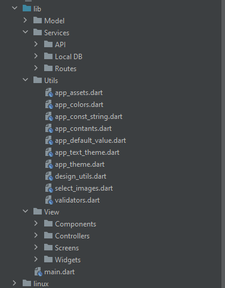
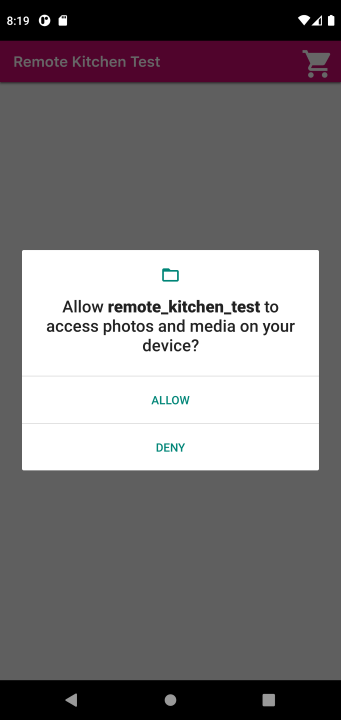
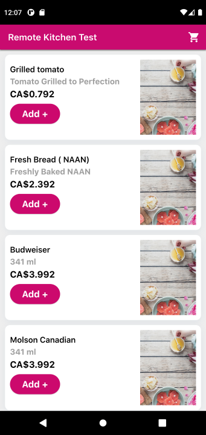
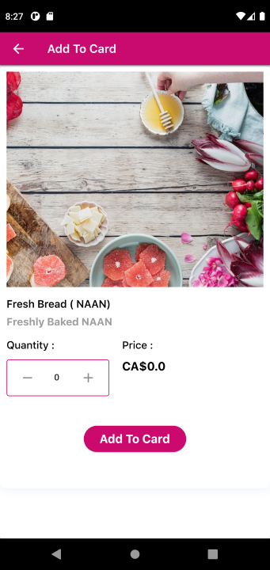
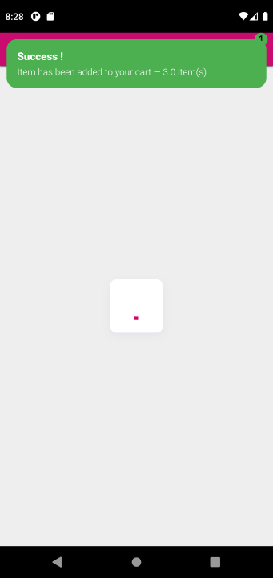
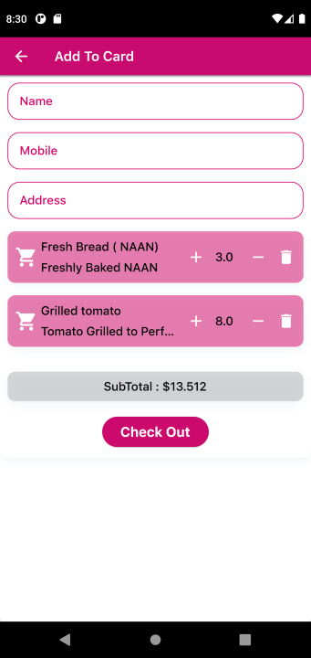
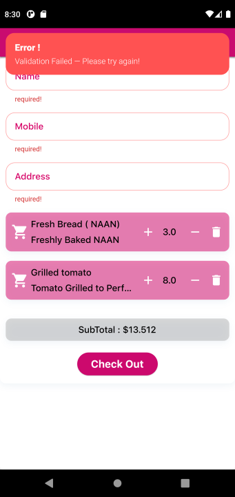
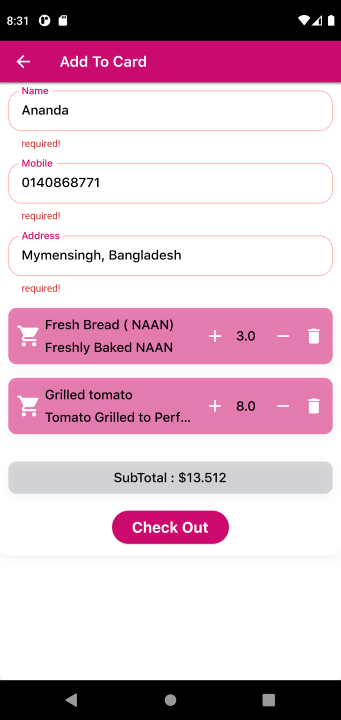
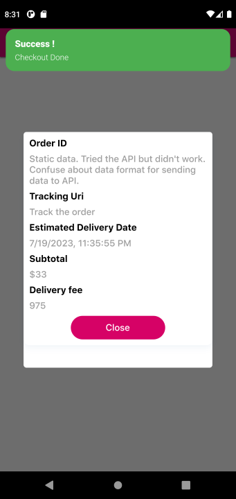

# Remote Kitchen App
Just showing list of Friends and it's details

# SDK
Flutter SDK: 3.10.6
Dart SDK: 3.0.6

# Dependencies:
* dio
* get
* cached_network_image
* flutter_spinbox
* sqflite
* permission_handler
* path_provider

# The Project:

You can run this project:

1. Direct on Android Studio Emulator by this [GitHub_link](https://github.com/RashadZA/Remote_Kitchen_Test)
2. Physical Device. [Apk_link](https://drive.google.com/file/d/1eFcOcJls9p305pAw4KTOtBetuvKH8clK/view?usp=sharing)

# How to Use the Project:

* After install APK and opening app Friends screen will show.
* Tapping on a friend card it will navigate to a detailed view of the friend displaying.
* Tapping on the friend’s email the mail app will open for sending email.

## Inside Structure of Lib Directory Screenshots

## APP Screenshots:

